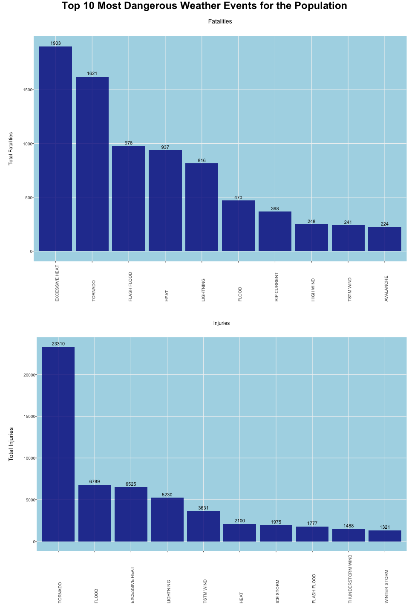
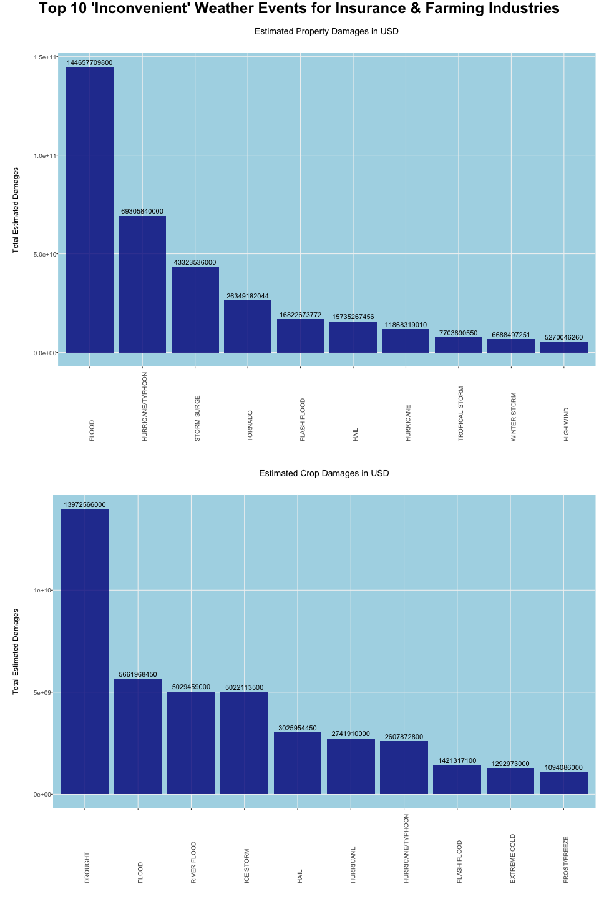

---
output:
  html_document:
    fig_caption: yes
    keep_md: yes
    number_sections: yes
    theme: cosmo
  pdf_document:
    toc: yes
  word_document: default
---

---
title: "Extreme Weather Impact Analysis (NOAA Storm Database) from 1993 to 2011"
author: "Bjoern W. Steffens"
date: "February 20, 2016"
output: html_document
---

<!---
```{r global_options, echo=FALSE}
knitr::opts_chunk$set(echo=TRUE, cache=TRUE)
knitr::opts_knit$set(progress=TRUE, verbose=TRUE)
```
--->

***
# Synopsis

This study looks at data collected from 1993 to 2011 about various disastrous weather events. Fatalities, injuries, property and crop damages are looked at separately and the top 10 most harmful weather events are presented individually. Fatalities and Injuries provide one view of the data and property and crop damages provides a second view. The data filtering and transformation applied is described in depth in section "Data Processing, Filtering & Transformations". The R code producing the plots is provided in the appendix at the end of this paper. The data in the original data set dates from 1950 to 2011. The section "Results" elaborates on why this data has not been considered.


***
# Results

Analyzing the data, described in section "Data Processing & Exploration", we learn that different disastrous weather events are more or less dangerous to the population, more or less costly to properties such as buildings, objects or crop. Adjusting the data set for integrity and data consistency issues, described in section "Data Processing, Filtering & Transformations", we arrive at the results illustrated in table 1.


Most Impactful Weather Events   | Group         | Amount/Count      | Comment
--------------------------      | --------      | ------------:     | --------
Excessive Heat                  | Fatalities    | 1,903             | Fatalities directly or indirectly related to the event
Tornado                         | Injuries      | 23,310            | Injuries directly or indirectly related to the event
Flood                           | Property      | 144,657,709,800   | USD
Drought                         | Crop          | 13,972,566,000    | USD

Table 1 - Most Dangerous and Economically 'Inconvenient' Weather Events


An overview of the most disastrous weather events for the population are illustrated in figure 1. An overview of the most disastrous weather events for the insurance and farming industry are illustrated in figure 2. The graphs represent recorded data from weather events in between 1993 and 2011. The original data set provides data in between 1950 and 2011 but up till and including 1992 only three weather event types have been recorded. For that reason only, data from 1993 to 2011 is considered in order not to bias the analysis.

***
## Harmful Events 



***
## Economically Damaging Events




***
# Data Processing

The data for this analysis come in the form of a comma-separated-value file compressed via the bzip2 algorithm to reduce its size. The file has been downloaded from this web site:

Storm Data File: https://d396qusza40orc.cloudfront.net/repdata%2Fdata%2FStormData.csv.bz2

There is also some documentation of the database available. Here information is provided how some of the variables are constructed and/or defined.

National Weather Service Storm Data Documentation: https://d396qusza40orc.cloudfront.net/repdata%2Fpeer2_doc%2Fpd01016005curr.pdf
National Climatic Data Center Storm Events FAQ: https://d396qusza40orc.cloudfront.net/repdata%2Fpeer2_doc%2Fpd01016005curr.pdf

***
## Loading & Exploring Data

The downloaded/loaded file should have 902,297 observations of 39 variables. There should be no missing values in the columns we are aiming at looking closer at in the data set. The variables are listed below that we will be using for this analysis.

        * FATALITIES
        * INJURIES
        * PROPDMG
        * CROPDMG

### Loading Data

The data is loaded using the code illustrated below.

```{r eval = FALSE}

#
# Load the libraries we will be needing
library(RCurl)
library(data.table)
library(dplyr)
library(ggplot2)
library(grid)
library(gridExtra)

#
# Global variables
stormDataURL    <- "https://d396qusza40orc.cloudfront.net/repdata%2Fdata%2FStormData.csv.bz2"
stormDataFile   <- "resources_data/repdata_data_StormData.csv.bz2"
stormDwnLdDate  <- "resources_data/repdata_data_StormData.csv.bz2.DownLoadDate"

#
# Download the file if it is still avaliable
# unless we have it on disk
if (url.exists(stormDataURL)) {

    #
    # Does the local file exist?
    if (!file.exists(stormDataFile)) {
    
        dir.create("resources_data")
        dir.create("resources_illustrations")
        
        download.file(stormDataURL,
                      method = "libcurl",
                      destfile = stormDataFile)
                    
        #
        # Stamp download date
        date_Downloaded = c("Date Downloaded", date())
        write.csv(date_Downloaded, file = stormDwnLdDate )
    }
}


#
# Read the bz2 file into a data frame.
# fill = TRUE in case row lenght is not equal
stormData <- read.table(stormDataFile, 
                        header = TRUE, 
                        fill = TRUE, 
                        na.strings = "", sep = ",")

```


### Exploring Data

Inspecting the data we observe no missing values for our value columns:

        mean(is.na(stormData$FATALITIES))
        [1] 0
        
        mean(is.na(stormData$INJURIES))
        [1] 0
        
        mean(is.na(stormData$PROPDMG))
        [1] 0
        
        mean(is.na(stormData$CROPDMG))
        [1] 0
    

We do however observe irregularities for property damage exponents and crop damange exponents According to the available guidelines for storm data collection these columns should have either K (thousand), M (million) or B (billon). We find additional values and will transform those accordingly making a few assumptions. Transformation details can be found in the "Data Transformation" section.

        mean(is.na(stormData$PROPDMGEXP))
        [1] 0.5163865
        
        levels(stormData$PROPDMGEXP)
        "-" "?" "+" "0" "1" "2" "3" "4" "5" "6" "7" "8" "B" "h" "H" "K" "m" "M"
        
        mean(is.na(stormData$CROPDMGEXP))
        [1] 0.6853763
    
        levels(stormData$CROPDMGEXP)
        "?" "0" "2" "B" "k" "K" "m" "M"


Looking at the year of the events we observe that prior to 1993 there are no other event types except HAIL, TORNADO and TSTMWIND recorded which may skew the data. Considering this we will filter out data before 1993 in the analysis.

        #
        # Extract the events per year and visually inspect
        df_a <- stormData %>% group_by(BGN_YEAR,EVTYPE) %>% summarize(total = sum(FATALITIES))
        
        #
        # Count the types per year and visualize our findings
        df_b <- df_a %>% group_by(BGN_YEAR) %>% summarize(WeatherEvents = n_distinct(EVTYPE))
        ftable(df_b)

                 WeatherEvents 1 3 38 46 50 51 99 112 121 122 126 160 170 228 267 387
        BGN_YEAR                                                                     
        1950                   1 0  0  0  0  0  0   0   0   0   0   0   0   0   0   0
        1951                   1 0  0  0  0  0  0   0   0   0   0   0   0   0   0   0
        1952                   1 0  0  0  0  0  0   0   0   0   0   0   0   0   0   0
        1953                   1 0  0  0  0  0  0   0   0   0   0   0   0   0   0   0
        1954                   1 0  0  0  0  0  0   0   0   0   0   0   0   0   0   0
        1955                   0 1  0  0  0  0  0   0   0   0   0   0   0   0   0   0
        1956                   0 1  0  0  0  0  0   0   0   0   0   0   0   0   0   0
        1957                   0 1  0  0  0  0  0   0   0   0   0   0   0   0   0   0
        1958                   0 1  0  0  0  0  0   0   0   0   0   0   0   0   0   0
        1959                   0 1  0  0  0  0  0   0   0   0   0   0   0   0   0   0
        1960                   0 1  0  0  0  0  0   0   0   0   0   0   0   0   0   0
        1961                   0 1  0  0  0  0  0   0   0   0   0   0   0   0   0   0
        1962                   0 1  0  0  0  0  0   0   0   0   0   0   0   0   0   0
        1963                   0 1  0  0  0  0  0   0   0   0   0   0   0   0   0   0
        1964                   0 1  0  0  0  0  0   0   0   0   0   0   0   0   0   0
        1965                   0 1  0  0  0  0  0   0   0   0   0   0   0   0   0   0
        1966                   0 1  0  0  0  0  0   0   0   0   0   0   0   0   0   0
        1967                   0 1  0  0  0  0  0   0   0   0   0   0   0   0   0   0
        1968                   0 1  0  0  0  0  0   0   0   0   0   0   0   0   0   0
        1969                   0 1  0  0  0  0  0   0   0   0   0   0   0   0   0   0
        1970                   0 1  0  0  0  0  0   0   0   0   0   0   0   0   0   0
        1971                   0 1  0  0  0  0  0   0   0   0   0   0   0   0   0   0
        1972                   0 1  0  0  0  0  0   0   0   0   0   0   0   0   0   0
        1973                   0 1  0  0  0  0  0   0   0   0   0   0   0   0   0   0
        1974                   0 1  0  0  0  0  0   0   0   0   0   0   0   0   0   0
        1975                   0 1  0  0  0  0  0   0   0   0   0   0   0   0   0   0
        1976                   0 1  0  0  0  0  0   0   0   0   0   0   0   0   0   0
        1977                   0 1  0  0  0  0  0   0   0   0   0   0   0   0   0   0
        1978                   0 1  0  0  0  0  0   0   0   0   0   0   0   0   0   0
        1979                   0 1  0  0  0  0  0   0   0   0   0   0   0   0   0   0
        1980                   0 1  0  0  0  0  0   0   0   0   0   0   0   0   0   0
        1981                   0 1  0  0  0  0  0   0   0   0   0   0   0   0   0   0
        1982                   0 1  0  0  0  0  0   0   0   0   0   0   0   0   0   0
        1983                   0 1  0  0  0  0  0   0   0   0   0   0   0   0   0   0
        1984                   0 1  0  0  0  0  0   0   0   0   0   0   0   0   0   0
        1985                   0 1  0  0  0  0  0   0   0   0   0   0   0   0   0   0
        1986                   0 1  0  0  0  0  0   0   0   0   0   0   0   0   0   0
        1987                   0 1  0  0  0  0  0   0   0   0   0   0   0   0   0   0
        1988                   0 1  0  0  0  0  0   0   0   0   0   0   0   0   0   0
        1989                   0 1  0  0  0  0  0   0   0   0   0   0   0   0   0   0
        1990                   0 1  0  0  0  0  0   0   0   0   0   0   0   0   0   0
        1991                   0 1  0  0  0  0  0   0   0   0   0   0   0   0   0   0
        1992                   0 1  0  0  0  0  0   0   0   0   0   0   0   0   0   0
        1993                   0 0  0  0  0  0  0   0   0   0   0   1   0   0   0   0
        1994                   0 0  0  0  0  0  0   0   0   0   0   0   0   0   1   0
        1995                   0 0  0  0  0  0  0   0   0   0   0   0   0   0   0   1
        1996                   0 0  0  0  0  0  0   0   0   0   0   0   0   1   0   0
        1997                   0 0  0  0  0  0  0   0   0   0   0   0   1   0   0   0
        1998                   0 0  0  0  0  0  0   0   0   0   1   0   0   0   0   0
        1999                   0 0  0  0  0  0  0   0   1   0   0   0   0   0   0   0
        2000                   0 0  0  0  0  0  0   1   0   0   0   0   0   0   0   0
        2001                   0 0  0  0  0  0  0   0   0   1   0   0   0   0   0   0
        2002                   0 0  0  0  0  0  1   0   0   0   0   0   0   0   0   0
        2003                   0 0  0  0  0  1  0   0   0   0   0   0   0   0   0   0
        2004                   0 0  1  0  0  0  0   0   0   0   0   0   0   0   0   0
        2005                   0 0  0  1  0  0  0   0   0   0   0   0   0   0   0   0
        2006                   0 0  0  0  1  0  0   0   0   0   0   0   0   0   0   0
        2007                   0 0  0  1  0  0  0   0   0   0   0   0   0   0   0   0
        2008                   0 0  0  1  0  0  0   0   0   0   0   0   0   0   0   0
        2009                   0 0  0  1  0  0  0   0   0   0   0   0   0   0   0   0
        2010                   0 0  0  1  0  0  0   0   0   0   0   0   0   0   0   0
        2011                   0 0  0  1  0  0  0   0   0   0   0   0   0   0   0   0

***
## Filtering & Transforming Data

This section provides detailed information about filters that have been applied to remove certain observations and the rationale why those have not been considered for the analysis.


### Filtering Data

This secion provides detailed information about observations that have been filtered out in the analysis due to incorrect labelling. Having looked at this aspect of the data and we learned that property damages may not necessarily also have crop damages and vice versa. This is why we provide these charts separately.


#### Data Collection Integrity Issues

As we demonstrated in the data exploration section there are only 3 weather events recorded prior to 1993. Considering this new knowledge, observations prior to 1993 will not be considered for the analysis to prevent bias.

* HAIL
* TORNADO
* TSTMWIND

The data for the property and crop economic impact analysis are filtered by sub setting the data on the BGN_YEAR variable.

        #
        # Filter out data before 1993
        stormProp <- stormProp[with(stormProp, BGN_YEAR >= 1993),]
        stormCrop <- stormCrop[with(stormCrop, BGN_YEAR >= 1993),]


#### Data Collection Consistency Issues

Inspecting the exponent types for property damages we observe "-", "?", "+", "0", "1", "2", "3", "4", "5", "6", "7", "8", "B", "h", "H", "K", "m" and "M" next to the expected values. Visually inspecting that data with "-", "?", or "+" , they (14 observations) represent an estimated damage value of $132. We are not going to include these observations in the analysis because they do not pose a significant contribution and the end result of the analysis will not be impacted.

        levels(stormData$PROPDMGEXP)
        "-" "?" "+" "0" "1" "2" "3" "4" "5" "6" "7" "8" "B" "h" "H" "K" "m" "M"
        
        df_a <- stormData[with(stormData, grepl("[-?+]", stormData$PROPDMGEXP)),]
        
        df_a[,c(8,25,26)]
        
                            EVTYPE PROPDMG PROPDMGEXP
        188780    BREAKUP FLOODING      20          +
        189001           HIGH WIND      20          +
        192262 FLOODING/HEAVY RAIN       2          +
        198689  THUNDERSTORM WINDS       0          ?
        216755          HIGH WINDS      15          +
        216802             TORNADO      60          +
        225254         FLASH FLOOD       0          ?
        227409         FLASH FLOOD       0          ?
        229327           HIGH WIND      15          -
        232016   THUNDERSTORM WIND       0          ?
        233746                HAIL       0          ?
        233747                HAIL       0          ?
        233748                HAIL       0          ?
        247617  THUNDERSTORM WINDS       0          ?
        
        sum(df_a$PROPDMG)
        132


Inspecting the exponent types for crop damages we observe "?", "0" and "2" next to the expected values. Visually inspecting those 27 records we observe that "?", "0" and "2" represents an estimated damage value of $260. We are not going to include these observations in the analysis with the same rationale as provided above.

        levels(stormData$CROPDMGEXP)
        [1] "?" "0" "2" "B" "k" "K" "m" "M"
        
        df_a <- stormData[with(stormData, grepl("[?02]", stormData$CROPDMGEXP)),]
        
        df_a[,c(8,27,28)]
        
                           EVTYPE CROPDMG CROPDMGEXP
        192467  FLASH FLOOD WINDS       0          ?
        192758               HAIL       0          0
        194391 THUNDERSTORM WINDS       0          0
        194518            TORNADO       0          0
        196458               HAIL      20          0
        197066 THUNDERSTORM WINDS       0          ?
        197331 THUNDERSTORM WINDS       0          ?
        200544 THUNDERSTORM WINDS       5          0
        200888            TORNADO      50          0
        201146 THUNDERSTORM WINDS      25          0
        201647 THUNDERSTORM WINDS      25          0
        201917            TORNADO      60          0
        202102 THUNDERSTORM WINDS       5          0
        202103 THUNDERSTORM WINDS       5          0
        202108            TORNADO      50          0
        202121 THUNDERSTORM WINDS       5          0
        202122 THUNDERSTORM WINDS       5          0
        202217 THUNDERSTORM WINDS       5          0
        220300 THUNDERSTORM WINDS       0          ?
        220877  FLOOD/FLASH FLOOD       0          ?
        221151 THUNDERSTORM WINDS       0          2
        230929            DROUGHT       0          0
        231180               HAIL       0          0
        232901  FLOOD/FLASH FLOOD       0          ?
        234620 THUNDERSTORM WINDS       0          0
        242953 THUNDERSTORM WINDS       0          ?
        244437 HIGH WIND AND SEAS       0          0
        
        sum(df_a$CROPDMG)
        260


### Transforming Data

In the data set we adjust the start date and end date columns from a character value to a true date data type. We are also adding a column with the year portion of the beginning and ending dates.

        stormData$BGN_DATE <- as.Date(stormData$BGN_DATE, "%m/%d/%Y %H:%M:%S")
        stormData$BGN_YEAR <- as.POSIXlt(stormData$BGN_DATE)$year+1900
        stormData$END_DATE <- as.Date(stormData$END_DATE, "%m/%d/%Y %H:%M:%S")
        stormData$END_YEAR <- as.POSIXlt(stormData$END_DATE)$year+1900

        
#### Estimated Property Damages

Coming back to the observation we made earlier that there are unknown values in the property damage exponents (PROPDMGEXP) and crop damage exponents (CROPDMEXP). Looking closer at the PROPDMGEXP variable we have observed the following levels:

        levels(stormData$PROPDMGEXP)
        "-" "?" "+" "0" "1" "2" "3" "4" "5" "6" "7" "8" "B" "h" "H" "K" "m" "M"

According to the storm data gathering collection guidelines only K, M and B were supposed to be used. Based on our earlier data exploration above we will not consider "-", "?" or "+". In order to be able to calculate the total estimated property damage value we will create a new variable called PROPDMGEXPVAL and assign values according to the matrix below:


Exponent    |   Value
------------|------------
0           | 1e0
1           | 1e1
2           | 1e2
3           | 1e3
4           | 1e4
5           | 1e5
6           | 1e6
7           | 1e7
8           | 1e8
b or B      | 1e9
h or H      | 1e2
k or K      | 1e3
m or M      | 1e6

Table 2 - Property exponent transformation*


        #
        # Transform PROPDMGEXP->PROPDMGEXPVAL
        stormProp$PROPDMGEXPVAL[stormProp$PROPDMGEXP %in% "0"] <- 1e0
        stormProp$PROPDMGEXPVAL[stormProp$PROPDMGEXP %in% "1"] <- 1e1
        stormProp$PROPDMGEXPVAL[stormProp$PROPDMGEXP %in% "2"] <- 1e2
        stormProp$PROPDMGEXPVAL[stormProp$PROPDMGEXP %in% "3"] <- 1e3
        stormProp$PROPDMGEXPVAL[stormProp$PROPDMGEXP %in% "4"] <- 1e4
        stormProp$PROPDMGEXPVAL[stormProp$PROPDMGEXP %in% "5"] <- 1e5
        stormProp$PROPDMGEXPVAL[stormProp$PROPDMGEXP %in% "6"] <- 1e6
        stormProp$PROPDMGEXPVAL[stormProp$PROPDMGEXP %in% "7"] <- 1e7
        stormProp$PROPDMGEXPVAL[stormProp$PROPDMGEXP %in% "8"] <- 1e8
        stormProp$PROPDMGEXPVAL[stormProp$PROPDMGEXP %in% "b" | stormProp$PROPDMGEXP %in% "B"] <- 1e9
        stormProp$PROPDMGEXPVAL[stormProp$PROPDMGEXP %in% "h" | stormProp$PROPDMGEXP %in% "H"] <- 1e2
        stormProp$PROPDMGEXPVAL[stormProp$PROPDMGEXP %in% "k" | stormProp$PROPDMGEXP %in% "K"] <- 1e3
        stormProp$PROPDMGEXPVAL[stormProp$PROPDMGEXP %in% "m" | stormProp$PROPDMGEXP %in% "M"] <- 1e6


#### Estimated Crop Damages

Continuing to look closer at the CROPDMGEXP variable we have observed the following levels:

        levels(stormData$CROPDMGEXP)
        [1] "?" "0" "2" "B" "k" "K" "m" "M"

According to the storm data gathering collection guidelines only K, M and B were supposed to be used and based on our analysis above we will not consider "?", "0" or "2". In order to be able to calculate the total estimated crop damage value we will create a new variable called CROPDMGEXPVAL and assign values according to the matrix below:


Exponent    |   Value
------------|------------
b or B      | 1e9
k or K      | 1e3
m or M      | 1e6

Table 3 - Crop exponent transformation


        #
        # Transform CROPDMGEXP->CROPDMGEXPVAL
        stormCrop$CROPDMGEXPVAL[stormCrop$CROPDMGEXP %in% "b" | stormCrop$CROPDMGEXP %in% "B"] <- 1e9
        stormCrop$CROPDMGEXPVAL[stormCrop$CROPDMGEXP %in% "k" | stormCrop$CROPDMGEXP %in% "K"] <- 1e3
        stormCrop$CROPDMGEXPVAL[stormCrop$CROPDMGEXP %in% "m" | stormCrop$CROPDMGEXP %in% "M"] <- 1e6

***
# APPENDIX - The Complete Computer Code

    
```{r eval = FALSE, cache = TRUE, fig.width = 960, fig.height = 720}

#
# Load the libraries we will be needing
library(RCurl)
library(data.table)
library(dplyr)
library(ggplot2)
library(grid)
library(gridExtra)

#
# Global variables
stormDataURL    <- "https://d396qusza40orc.cloudfront.net/repdata%2Fdata%2FStormData.csv.bz2"
stormDataFile   <- "resources_data/repdata_data_StormData.csv.bz2"
stormDwnLdDate  <- "resources_data/repdata_data_StormData.csv.bz2.DownLoadDate"

#
# Download the file if it is still available
# unless we have it on disk
if (url.exists(stormDataURL)) {

    #
    # Does the local file exist?
    if (!file.exists(stormDataFile)) {
    
        dir.create("resources_data")
        dir.create("resources_illustrations")
        
        download.file(stormDataURL,
                      method = "libcurl",
                      destfile = stormDataFile)
                    
        #
        # Stamp download date
        date_Downloaded = c("Date Downloaded", date())
        write.csv(date_Downloaded, file = stormDwnLdDate )
    }
}

#
# Read the bz2 file into a data frame.
# fill = TRUE in case row lenght is not equal
stormData <- read.table("resources_data/repdata_data_StormData.csv.bz2", 
                        header = TRUE, 
                        fill = TRUE, 
                        na.strings = "", sep = ",")

#
# Tranform the dates
stormData$BGN_DATE <- as.Date(stormData$BGN_DATE, "%m/%d/%Y %H:%M:%S")
stormData$BGN_YEAR <- as.POSIXlt(stormData$BGN_DATE)$year+1900
stormData$END_DATE <- as.Date(stormData$END_DATE, "%m/%d/%Y %H:%M:%S")
stormData$END_YEAR <- as.POSIXlt(stormData$END_DATE)$year+1900

#
# Fatality and Injury calculations
#
stormFatal <- stormData %>% filter(BGN_YEAR >= 1993) %>% group_by(EVTYPE) %>% summarize(Fatalities = sum(FATALITIES))
colnames(stormFatal) <- c("Storm Type", "Fatalities")
stormFatal <- as.data.frame(stormFatal)
head(arrange(stormFatal, desc(Fatalities)),10)

stormInjury <- stormData %>% filter(BGN_YEAR >= 1993) %>% group_by(EVTYPE) %>% summarize(Injuries = sum(INJURIES))
colnames(stormInjury) <- c("Storm Type", "Injuries")
stormInjury <- as.data.frame(stormInjury)
head(arrange(stormInjury, desc(Injuries)),10)

plotFatality <- head(arrange(stormFatal, desc(Fatalities)),10)
plotInjuries <- head(arrange(stormInjury, desc(Injuries)),10)

p1 <- ggplot(aes(x = `Storm Type`, y = Fatalities), data = plotFatality) + 
    geom_bar(fill = "dark blue", stat = "identity", alpha = 0.8) + 
    ggtitle("Fatalities") +
    ylab("Total Fatalities") +
    scale_x_discrete(limits=plotFatality$`Storm Type`) +
    geom_text(aes(label=round(Fatalities,0)), 
              position = position_dodge(width=0.9), 
              vjust=-.5, 
              color="black") +
    theme(axis.text.x = element_text(angle = 90, hjust = 0)) +
    theme(panel.background = element_rect(fill = "lightblue")) +
    theme(strip.background = element_rect(fill = "lightblue")) +
    theme(panel.grid.minor = element_blank()) +
    theme(panel.grid.major = element_line(colour = "grey95")) +
    theme(axis.text.x = element_text(size=10,margin = margin(5,0,20,0))) +
    theme(axis.text.y = element_text(size=10,margin = margin(0,0,0,10))) +
    theme(plot.title = element_text(size = 14,margin = margin(15,15,30,15))) +
    #theme(axis.title.x = element_text(size = 16,margin = margin(15,15,30,15))) +
    theme(axis.title.x=element_blank()) +
    theme(axis.title.y = element_text(size = 12,margin = margin(15,15,30,15))) 
    #theme(plot.margin=unit(c(1,1,1,1),"cm"))


p2 <- ggplot(aes(x = `Storm Type`, y = Injuries), data = plotInjuries) + 
    geom_bar(fill = "dark blue", stat = "identity", alpha = 0.8) + 
    ggtitle("Injuries") +
    xlab("Type") + 
    ylab("Total Injuries") +
    scale_x_discrete(limits=plotInjuries$`Storm Type`) +
    geom_text(aes(label=round(Injuries,0)), 
              position = position_dodge(width=0.9), 
              vjust=-.5, 
              color="black") +
    theme(axis.text.x = element_text(angle = 90, hjust = 0)) +
    theme(panel.background = element_rect(fill = "lightblue")) +
    theme(strip.background = element_rect(fill = "lightblue")) +
    theme(panel.grid.minor = element_blank()) +
    theme(panel.grid.major = element_line(colour = "grey95")) +
    theme(axis.text.x = element_text(size=10,margin = margin(5,0,20,0))) +
    theme(axis.text.y = element_text(size=10,margin = margin(0,0,0,10))) +
    theme(plot.title = element_text(size = 12,margin = margin(15,15,30,15))) +
    #theme(axis.title.x = element_text(size = 16,margin = margin(15,15,30,15))) +
    theme(axis.title.x=element_blank()) +
    theme(axis.title.y = element_text(size = 14,margin = margin(15,15,30,15))) 
    #theme(plot.margin=unit(c(1,1,1,1),"cm")) 

png(filename = "resources_illustrations/event_impact_fatalinjury.png", width = 960, height = 1440)
grid.arrange(p1,p2, nrow = 2, 
            top = textGrob("Top 10 Most Dangerous Weather Events for the Population",gp=gpar(fontsize=24,font=2)))
dev.off()

#
# CropPropCalculations
#

# I want to separete property damages from crop damages. A weather event can be
# damaging to crop but not necessarily to properties and vice versa depending
# on where it takes place.

#
# Filter and select
stormProp <- stormData[with(stormData, grepl("[012345678bBhHkKmM]", stormData$PROPDMGEXP)),]
stormCrop <- stormData[with(stormData, grepl("[bBkKmM]", stormData$CROPDMGEXP)),]

#
# Filter out data before 1993
stormProp <- stormProp[with(stormProp, BGN_YEAR >= 1993),]
stormCrop <- stormCrop[with(stormCrop, BGN_YEAR >= 1993),]

#
# Transform PROPDMGEXP->PROPDMGEXPVAL
stormProp$PROPDMGEXPVAL[stormProp$PROPDMGEXP %in% "0"] <- 1e0
stormProp$PROPDMGEXPVAL[stormProp$PROPDMGEXP %in% "1"] <- 1e1
stormProp$PROPDMGEXPVAL[stormProp$PROPDMGEXP %in% "2"] <- 1e2
stormProp$PROPDMGEXPVAL[stormProp$PROPDMGEXP %in% "3"] <- 1e3
stormProp$PROPDMGEXPVAL[stormProp$PROPDMGEXP %in% "4"] <- 1e4
stormProp$PROPDMGEXPVAL[stormProp$PROPDMGEXP %in% "5"] <- 1e5
stormProp$PROPDMGEXPVAL[stormProp$PROPDMGEXP %in% "6"] <- 1e6
stormProp$PROPDMGEXPVAL[stormProp$PROPDMGEXP %in% "7"] <- 1e7
stormProp$PROPDMGEXPVAL[stormProp$PROPDMGEXP %in% "8"] <- 1e8
stormProp$PROPDMGEXPVAL[stormProp$PROPDMGEXP %in% "b" | stormProp$PROPDMGEXP %in% "B"] <- 1e9
stormProp$PROPDMGEXPVAL[stormProp$PROPDMGEXP %in% "h" | stormProp$PROPDMGEXP %in% "H"] <- 1e2
stormProp$PROPDMGEXPVAL[stormProp$PROPDMGEXP %in% "k" | stormProp$PROPDMGEXP %in% "K"] <- 1e3
stormProp$PROPDMGEXPVAL[stormProp$PROPDMGEXP %in% "m" | stormProp$PROPDMGEXP %in% "M"] <- 1e6

#
# Transform CROPDMGEXP->CROPDMGEXPVAL
stormCrop$CROPDMGEXPVAL[stormCrop$CROPDMGEXP %in% "b" | stormCrop$CROPDMGEXP %in% "B"] <- 1e9
stormCrop$CROPDMGEXPVAL[stormCrop$CROPDMGEXP %in% "k" | stormCrop$CROPDMGEXP %in% "K"] <- 1e3
stormCrop$CROPDMGEXPVAL[stormCrop$CROPDMGEXP %in% "m" | stormCrop$CROPDMGEXP %in% "M"] <- 1e6


#
# Prepare the Property Damage plot
stormProgDmg <- stormProp %>% group_by(EVTYPE) %>% summarize(Damages = sum(PROPDMG*as.numeric(PROPDMGEXPVAL)))
colnames(stormProgDmg) <- c("Storm Type", "Damages")
stormProgDmg <- as.data.frame(stormProgDmg)
plotstormPropDmg <- head(arrange(stormProgDmg, desc(Damages)),10)

p1 <- ggplot(aes(x = `Storm Type`, y = Damages), data = plotstormPropDmg) + 
    geom_bar(fill = "dark blue", stat = "identity", alpha = 0.8) + 
    ggtitle("Estimated Property Damages in USD") +
    ylab("Total Estimated Damages") +
    scale_x_discrete(limits=plotstormPropDmg$`Storm Type`) +
    geom_text(aes(label=round(Damages,0)), 
              position = position_dodge(width=0.9), 
              vjust=-.5, 
              color="black") +
    theme(axis.text.x = element_text(angle = 90, hjust = 0)) +
    theme(panel.background = element_rect(fill = "lightblue")) +
    theme(strip.background = element_rect(fill = "lightblue")) +
    theme(panel.grid.minor = element_blank()) +
    theme(panel.grid.major = element_line(colour = "grey95")) +
    theme(axis.text.x = element_text(size=10,margin = margin(5,0,20,0))) +
    theme(axis.text.y = element_text(size=10,margin = margin(0,0,0,10))) +
    theme(plot.title = element_text(size = 14,margin = margin(15,15,30,15))) +
    #theme(axis.title.x = element_text(size = 16,margin = margin(15,15,30,15))) +
    theme(axis.title.x=element_blank()) +
    theme(axis.title.y = element_text(size = 12,margin = margin(15,15,30,15))) 
    #theme(plot.margin=unit(c(1,1,1,1),"cm"))

#
# Prepare the Crop Damage plot
stormCropDmg <- stormCrop %>% group_by(EVTYPE) %>% summarize(Damages = sum(CROPDMG*as.numeric(CROPDMGEXPVAL)))
colnames(stormCropDmg) <- c("Storm Type", "Damages")
stormCropDmg <- as.data.frame(stormCropDmg)
plotstormCropDmg <- head(arrange(stormCropDmg, desc(Damages)),10)

p2 <- ggplot(aes(x = `Storm Type`, y = Damages), data = plotstormCropDmg) + 
    geom_bar(fill = "dark blue", stat = "identity", alpha = 0.8) + 
    ggtitle("Estimated Crop Damages in USD") +
    ylab("Total Estimated Damages") +
    scale_x_discrete(limits=plotstormCropDmg$`Storm Type`) +
    geom_text(aes(label=round(Damages,0)), 
              position = position_dodge(width=0.9), 
              vjust=-.5, 
              color="black") +
    theme(axis.text.x = element_text(angle = 90, hjust = 0)) +
    theme(panel.background = element_rect(fill = "lightblue")) +
    theme(strip.background = element_rect(fill = "lightblue")) +
    theme(panel.grid.minor = element_blank()) +
    theme(panel.grid.major = element_line(colour = "grey95")) +
    theme(axis.text.x = element_text(size=10,margin = margin(5,0,20,0))) +
    theme(axis.text.y = element_text(size=10,margin = margin(0,0,0,10))) +
    theme(plot.title = element_text(size = 14,margin = margin(15,15,30,15))) +
    #theme(axis.title.x = element_text(size = 16,margin = margin(15,15,30,15))) +
    theme(axis.title.x=element_blank()) +
    theme(axis.title.y = element_text(size = 12,margin = margin(15,15,30,15))) 
    #theme(plot.margin=unit(c(1,1,1,1),"cm"))


png(filename = "resources_illustrations/event_impact_propcrop.png", width = 960, height = 1440)
grid.arrange(p1,p2, nrow = 2,
             top = textGrob("Top 10 'Inconvenient' Weather Events for Insurance & Farming Industries",gp=gpar(fontsize=24,font=2)))
dev.off()


```

